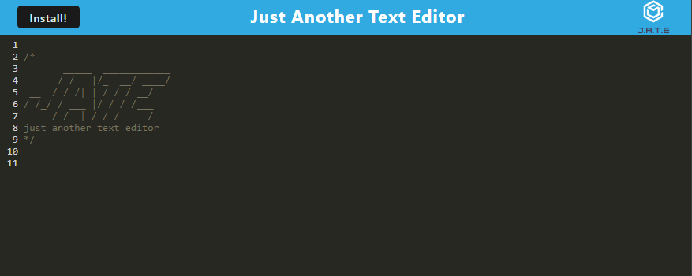
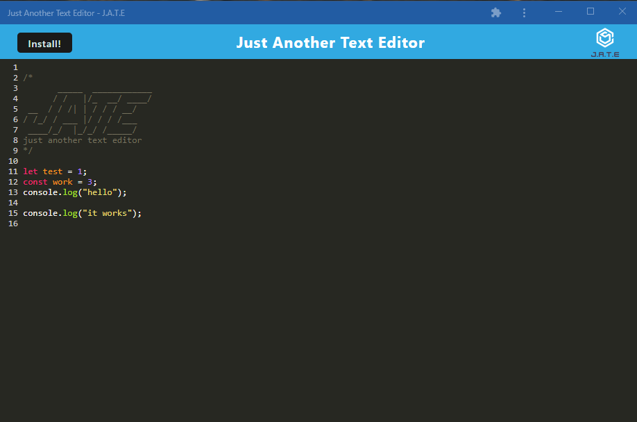

 

# Unit 19: Text Editor PWA

## [Description](#description)

In this homework, I created a text editor application that takes notes. This is a single page application that meets the PWA criteria. Additionally, the application features a number of data persistence techniques that serve as redundancy in case the options is not supported by the browser. The application also funtion offline. 

When the appication runs it displays an editor page where the user can input notes. if the editor conection is lost, the editor will still function. The editor has a button to install the application on the desktop. When the application is run on the desktop, it functions the same way the application funtions on the browser.   

### Link to application:

To deploy the application, I am using Heroku. Here is the Link to the deployment of the [application](https://text-editor-mm-19.herokuapp.com/) and this is the link to the [repository](https://github.com/MaryMD98/Text-editor.git).

## Table of Content

* [Description](#description)
* [Installation](#installation)
* [Test](#test)
* [Usage](#usage)
* [License](#license)
* [Contributing](#contributing)
* [Questions](#questions)

## [Installation](#installation)
To initialie, after cloning the repo, run the following command.

    npm run start 

## [Test](#test)
To run tests, run the following command

    no test available at this moment

## [Usage](#usage)

This is a simple text editor application that can be downloaded and installed on the desktop. The application also runs offline.

### Screenshot of Employee Tracker Comand Lines:

## [License](#license)

## [Contributing](#contributing)

none

## [Questions](#questions)

If you have any questions about the repo, or would like to contact me directly, 
here is my email: maribel.montes4@gmail.com. You can find more of my work at [Maribel Montes](https://github.com/MaryMD98).

